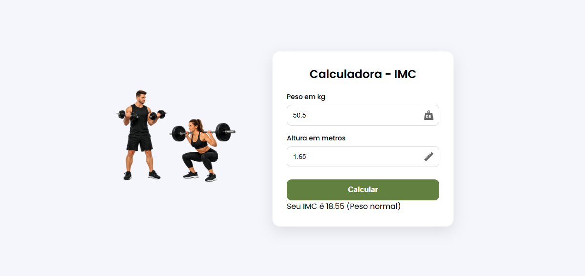

# 🧮 Calculadora de IMC

Projeto desenvolvido com **HTML, CSS e JavaScript** que calcula o **Índice de Massa Corporal (IMC)** a partir do peso e da altura informados pelo usuário, exibindo também a classificação correspondente.

---

## 🚀 Funcionalidades

- Entrada de **peso (kg)** e **altura (m)**
- Validação de campos obrigatórios
- Cálculo automático do IMC
- Classificação do IMC:
  - Abaixo do peso
  - Peso normal
  - Excesso de peso
  - Obesidade (classes I, II e III)
- Exibição do resultado na tela
- Interface responsiva e amigável

---

## 🛠️ Tecnologias Utilizadas

- HTML5  
- CSS3  
- JavaScript (DOM, eventos e lógica condicional)

---

## 📂 Estrutura de Pastas

```text
projeto-imc/
├── html/
│   └── index.html
├── css/
│   └── styles.css
├── js/
│   └── script.js
└── img/
    ├── foto.png
    ├── kg.png
    └── regua.png

## 📸 Preview do Projeto




👩‍💻 Autora

Pamella Oliveira
Estudante de Análise e Desenvolvimento de Sistemas
Focada em desenvolvimento web e JavaScript 🚀
